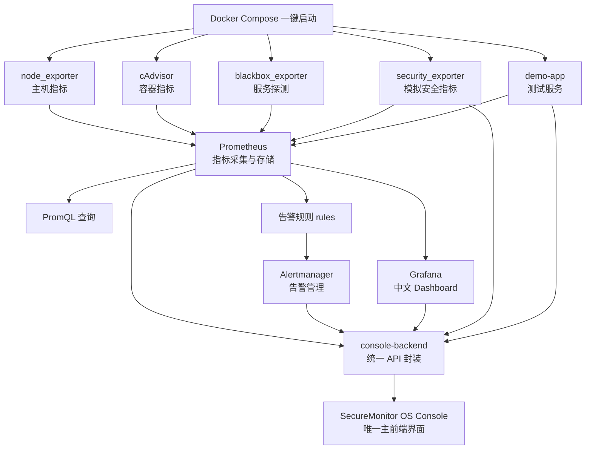

# SecureMonitor OS

基于 Docker / Kubernetes 的 Prometheus + Grafana 安全监控可视化操作台。

本项目对应《网络安全编程技术与实例开发》课程设计第 4 题：基于 Docker 构建 Prometheus + Grafana 监控集群模型及技术实现。

## 1. 项目定位

SecureMonitor OS 不是一个真正的操作系统内核，而是一个“类操作系统风格”的安全监控 Web 控制台。它把 Prometheus、Grafana、Alertmanager、node_exporter、cAdvisor、blackbox_exporter、自定义 security_exporter、demo-app 和 Kubernetes 研究内容整合到同一个课程设计项目中。

本项目对外展示的主前端只有一个：

```text
http://127.0.0.1:7001
```

也就是 SecureMonitor OS Console。Prometheus、Grafana、Alertmanager、cAdvisor 等地址是开源组件自带页面或验证入口，用来证明指标采集、告警、Dashboard、服务探测等功能确实存在，不作为本项目的主要前端界面。

本项目采用以下实现策略：

| 策略 | 说明 |
| --- | --- |
| Docker Compose 主实现 | 用于本地运行、演示、截图和答辩 |
| Kubernetes 扩展研究 | 通过文档和 YAML 示例说明 Kubernetes 监控方案 |
| SecureMonitor OS 主界面 | 统一展示监控状态、告警、安全指标、异常模拟和文档入口 |
| Grafana Dashboard | 使用第三方开源 Grafana 展示 Prometheus 指标曲线和 Dashboard |
| 文档与答辩材料 | 为课程报告、测试记录和答辩讲解准备 Markdown 文档 |

## 2. 课程要求对应关系

| 课程要求 | 本项目实现 |
| --- | --- |
| 搭建 Prometheus + Grafana 全方位监控告警系统 | 使用 Docker Compose 启动 Prometheus、Grafana、Alertmanager 和多个 Exporter |
| 配置 Prometheus 动态、静态服务发现 | `prometheus/prometheus.yml` 中配置 `static_configs` 和 `file_sd_configs` |
| 监控容器、物理节点、service、pod 等资源 | node_exporter 监控主机，cAdvisor 监控容器，blackbox_exporter 监控服务，Kubernetes 文档说明 Pod / Service / Deployment 监控 |
| Grafana Web 页面展示 Prometheus 指标 | Grafana 自动加载 Prometheus 数据源和 Dashboard JSON |
| 研究 Docker 与 Kubernetes 安全监控 | Docker 部分实现可运行系统，Kubernetes 部分提供研究文档和示例 YAML |
| 研究 Prometheus 告警工具包 | 编写 Prometheus rules，并配置 Alertmanager |
| 研究 Prometheus 在 Kubernetes 集群下部署 | `docs/07_kubernetes_research.md` 和 `k8s/` 示例说明 |
| 添加 Prometheus 作为 Grafana 输入源 | `grafana/provisioning/datasources/prometheus.yml` 自动配置数据源 |
| 完成 Prometheus 和 Grafana 在 docker 环境部署 | `docker-compose.yml` 中完成服务编排 |
| 对本机服务器性能和集群状态监控 | node_exporter、cAdvisor、Targets、Alerts、Grafana Dashboard 和 SecureMonitor OS 总览页共同展示 |

## 3. 技术栈

| 类型 | 技术 |
| --- | --- |
| 容器编排 | Docker Compose |
| 指标采集与存储 | Prometheus |
| 可视化 | Grafana |
| 告警管理 | Alertmanager |
| 主机指标 | node_exporter |
| 容器指标 | cAdvisor |
| 服务探测 | blackbox_exporter |
| 自定义安全指标 | security_exporter |
| 测试服务 | demo-app |
| 后端控制台 | Python FastAPI |
| 前端控制台 | React + Vite + TypeScript |
| Kubernetes 扩展 | kind / minikube / kube-prometheus-stack 研究 |

## 4. 服务组成

本项目答辩展示时只需要打开一个主要界面：

```text
http://127.0.0.1:7001
```

也就是 SecureMonitor OS Console。下面表格只说明各服务在系统中的职责，不再把每个组件的原生访问地址都放在“服务组成”中，避免把项目展示成多个分散页面。

| 服务 | 展示方式 | 作用 |
| --- | --- | --- |
| SecureMonitor OS Console | 主界面直接访问 `http://127.0.0.1:7001` | 统一可视化控制台，答辩主要展示页面 |
| console-backend | 由主界面自动调用 | 封装 Prometheus、Alertmanager、Grafana、Exporter API |
| Prometheus | 通过主界面的总览、Targets、告警中心间接展示 | 指标采集、PromQL 查询、Targets、Alerts 和告警规则 |
| Grafana | 通过主界面的 Grafana 入口打开 Dashboard | Dashboard 可视化，默认账号 `admin/admin` |
| Alertmanager | 通过主界面的告警中心展示 | 告警分组、去重、路由和展示 |
| node_exporter | 通过主界面的主机监控展示 | 本机 CPU、内存、磁盘、网络等物理节点指标 |
| cAdvisor | 通过主界面的容器监控展示 | Docker 容器 CPU、内存、网络、磁盘 IO 指标 |
| blackbox_exporter | 通过主界面的服务探测展示 | HTTP/TCP 服务可用性探测 |
| security_exporter | 通过主界面的安全中心展示 | 自定义模拟安全指标 |
| demo-app | 通过主界面的服务探测和异常模拟展示 | 被监控测试服务，用于服务可用性、HTTP 指标和异常接口演示 |

如果 `localhost` 访问异常，主界面优先使用 `127.0.0.1:7001`。

## 5. 项目总体流程

1. Docker Compose 一键启动 Prometheus、Grafana、Alertmanager、node_exporter、cAdvisor、blackbox_exporter、security_exporter、demo-app、console-backend 和 console-frontend。
2. node_exporter 采集本机 CPU、内存、磁盘、网络等物理节点指标。
3. cAdvisor 采集 Docker 容器 CPU、内存、网络、磁盘 IO 和运行状态指标。
4. blackbox_exporter 对 demo-app 的 `/health` 接口进行 HTTP 可用性探测。
5. security_exporter 暴露失败登录次数、可疑请求次数、开放端口数量、容器重启次数、高 CPU 进程数量、安全风险分数等模拟安全指标。
6. demo-app 提供 `/health`、`/metrics`、`/api/hello`、`/api/error`、`/api/slow` 等测试接口。
7. Prometheus 根据 `prometheus.yml` 中的 `static_configs` 和 `file_sd_configs` 发现目标并抓取指标。
8. Prometheus 根据 `prometheus/rules/*.yml` 判断 CPU、内存、磁盘、服务可用性、容器状态和安全指标是否满足告警条件。
9. Prometheus 将告警发送给 Alertmanager。
10. Alertmanager 对告警进行分组、去重、路由和展示。
11. Grafana 通过 provisioning 自动加载 Prometheus 数据源和四类 Dashboard。
12. SecureMonitor OS 前端通过 console-backend 读取 Prometheus、Alertmanager、Grafana 和 security_exporter 数据，形成统一中文可视化界面。

## 6. 架构流程图



## 7. 目录结构说明

| 目录或文件 | 作用 |
| --- | --- |
| `docker-compose.yml` | Docker Compose 主部署文件，启动全部监控服务和 SecureMonitor OS |
| `prometheus/` | Prometheus 配置、动态服务发现文件、告警规则 |
| `grafana/` | Grafana 数据源 provisioning 和 Dashboard JSON |
| `alertmanager/` | Alertmanager 告警路由、分组和接收器配置 |
| `blackbox/` | blackbox_exporter 探测模块配置 |
| `exporters/security_exporter/` | 自定义安全指标 Exporter |
| `demo-app/` | 被监控测试服务 |
| `console-backend/` | SecureMonitor OS 后端 API，封装监控组件接口 |
| `console-frontend/` | SecureMonitor OS 主前端界面 |
| `scripts/` | 异常模拟脚本 |
| `k8s/` | Kubernetes 扩展研究示例文件 |
| `docs/` | 课程设计文档、测试计划、测试报告、答辩稿和报告大纲 |
| `AGENTS.md` | 项目开发规则和课程目标说明 |

## 8. 启动与停止

### 8.1 前置条件

本项目需要本机安装并启动 Docker Desktop。Windows 环境建议启用 WSL2 后端。

启动前建议检查：

```powershell
docker version
docker compose version
docker info
```

如果 `docker info` 中 Server 部分报错，说明 Docker Engine 没有正常启动，需要先修复 Docker Desktop。

### 8.2 启动全部服务

进入项目目录：

```powershell
cd C:\Users\52697\secure-monitor
```

启动全部服务：

```powershell
docker compose up -d
```

查看容器状态：

```powershell
docker compose ps
```

正常情况下，应能看到 Prometheus、Grafana、Alertmanager、node-exporter、cadvisor、blackbox-exporter、security-exporter、demo-app、console-backend、console-frontend 等服务处于运行状态。

### 8.3 停止服务

停止全部服务：

```powershell
docker compose down
```

停止并删除持久化数据卷：

```powershell
docker compose down -v
```

注意：`docker compose down -v` 会删除 Prometheus、Grafana、Alertmanager 的本地数据卷，只有需要重新初始化时才使用。

## 9. SecureMonitor OS 主界面说明

SecureMonitor OS Console 是本项目唯一主要前端页面，访问地址：

```text
http://127.0.0.1:7001
```

主界面采用“安全运维驾驶舱”布局，包含顶部状态栏、左侧功能按钮、中间内容窗口和右侧通知中心。

### 9.1 顶部状态栏

顶部状态栏用于快速判断系统是否正常：

| 展示项 | 含义 | 答辩讲解方式 |
| --- | --- | --- |
| Prometheus | Prometheus 服务是否可访问 | 绿色表示指标采集核心服务正常 |
| Grafana | Grafana 是否可访问 | 绿色表示 Dashboard 服务正常 |
| Alertmanager | Alertmanager 是否可访问 | 绿色表示告警管理服务正常 |
| Targets | Prometheus 当前监控目标在线数量 | 例如 `8/8` 表示 8 个目标全部正常 |
| Alerts | 当前活跃告警数量 | 用于观察告警是否触发 |
| CPU | 本机 CPU 使用率摘要 | 来自 node_exporter 指标 |
| MEM | 本机内存使用率摘要 | 来自 node_exporter 指标 |
| DISK | 本机磁盘使用率摘要 | 来自 node_exporter 指标 |
| 当前时间 | 页面当前时间 | 用于截图和演示记录 |

### 9.2 左侧功能按钮

主界面左侧是功能入口，答辩时可以按从上到下的顺序讲解。

#### 9.2.1 总览

“总览”是最适合作为第一张截图的页面。

主要展示：

- 系统状态：Prometheus、Grafana、Alertmanager 是否正常。
- Targets 在线数量：说明 Prometheus 已经采集到多个监控目标。
- 活跃告警数：说明告警系统已经接入。
- CPU、内存、磁盘摘要：说明本机服务器性能监控已经实现。
- 安全风险分数：说明 security_exporter 安全监控指标已经接入。
- 服务拓扑：展示 Exporters、Prometheus、Alertmanager、Grafana、SecureMonitor OS 的关系。
- 最近告警：展示当前告警名称、等级、状态和描述。

答辩讲解建议：

1. 先说明这是统一控制台，不需要分别打开多个系统。
2. 指出顶部状态栏和总览卡片都来自后端 API。
3. 说明 Targets、Alerts、安全风险分数都来自 Prometheus 或 Alertmanager。
4. 强调这里不是直接展示原始 JSON，而是做了中文化、卡片化和表格化处理。

#### 9.2.2 主机监控

“主机监控”用于展示本机服务器性能。

主要展示：

- CPU 使用率。
- 内存使用率。
- 磁盘使用率。
- 网络收发速率。
- node_exporter 在线状态。

数据来源：

- Prometheus 抓取 `node-exporter:9100`。
- 核心指标包括 `node_cpu_seconds_total`、`node_memory_MemAvailable_bytes`、`node_filesystem_*`、`node_network_*`。

答辩讲解建议：

1. 说明 node_exporter 负责采集物理节点指标。
2. 展示 CPU、内存、磁盘指标。
3. 如果需要更详细曲线，可以从 Grafana 页面跳转到主机监控 Dashboard。

#### 9.2.3 容器监控

“容器监控”用于展示 Docker 容器运行状态。

主要展示：

- 容器 CPU 使用率。
- 容器内存使用。
- 容器网络 IO。
- cAdvisor 在线状态。
- 容器资源占用摘要。

数据来源：

- Prometheus 抓取 `cadvisor:8080`。
- 核心指标包括 `container_cpu_usage_seconds_total`、`container_memory_usage_bytes`、`container_network_receive_bytes_total`、`container_network_transmit_bytes_total`。

答辩讲解建议：

1. 说明 cAdvisor 和 node_exporter 的区别。
2. node_exporter 看主机，cAdvisor 看容器。
3. 这部分对应课程要求中的容器资源指标监控。

#### 9.2.4 服务探测

“服务探测”用于展示 demo-app 的可用性。

主要展示：

- demo-app 是否在线。
- blackbox_exporter 探测是否成功。
- `probe_success` 探测成功状态。
- `probe_duration_seconds` 探测耗时。
- HTTP 请求总数和错误请求数。

数据来源：

- Prometheus 直接抓取 demo-app 的 `/metrics`。
- Prometheus 通过 blackbox_exporter 探测 `http://demo-app:5000/health`。

答辩讲解建议：

1. 说明普通 `/metrics` 采集是应用主动暴露指标。
2. blackbox 探测是站在外部用户视角检查服务是否可访问。
3. 这部分对应课程要求中的 service 可用性监控。

#### 9.2.5 Targets

“Targets”页面用于验证 Prometheus 是否成功发现和采集目标。

主要展示：

- Job 名称。
- Instance 地址。
- Health 状态。
- 最近抓取时间。
- 抓取耗时。
- 抓取 URL。
- 错误信息。
- Labels 标签。

支持能力：

- 按健康状态过滤：全部、正常、异常。
- 按 job 或 instance 搜索。
- 查看 target 详情。

答辩讲解建议：

1. 展示 `prometheus`、`node-exporter`、`cadvisor`、`alertmanager`、`blackbox-exporter` 等静态发现目标。
2. 展示 `security-exporter`、`demo-app` 等文件型动态发现目标。
3. 说明 `static_configs` 适合固定服务，`file_sd_configs` 适合动态维护目标列表。

#### 9.2.6 安全中心

“安全中心”用于展示自定义 security_exporter 暴露的模拟安全指标。

主要展示：

| 指标 | 中文含义 | 类型 | 说明 |
| --- | --- | --- | --- |
| `security_failed_login_total` | 失败登录次数 | Counter | 短时间增长过快可能表示暴力破解或异常登录尝试 |
| `security_suspicious_request_total` | 可疑请求次数 | Counter | 可能表示异常访问、扫描或攻击尝试 |
| `security_open_port_count` | 开放端口数量 | Gauge | 开放端口过多会增加攻击面 |
| `security_container_restart_total` | 容器重启次数 | Counter | 频繁重启可能表示服务崩溃或资源异常 |
| `security_high_cpu_process_count` | 高 CPU 进程数量 | Gauge | 可能表示异常计算任务或资源消耗攻击 |
| `security_risk_score` | 安全风险分数 | Gauge | 0-100 分，分数越高风险越高 |

答辩讲解建议：

1. 说明这些指标用于课程设计模拟，不读取真实隐私数据。
2. 说明 security_exporter 的作用是把安全事件转成 Prometheus 可采集的指标。
3. 结合异常模拟页面触发失败登录或安全风险分数变化。

#### 9.2.7 告警中心

“告警中心”用于统一展示 Prometheus 和 Alertmanager 告警。

主要展示：

- 活跃告警总数。
- Critical 告警数。
- Warning 告警数。
- 告警名称。
- 严重等级。
- 当前状态。
- 来源 Job / Instance。
- 触发时间。
- 持续时间。
- 摘要和描述。

答辩讲解建议：

1. 说明 Prometheus 根据 rules 判断是否触发告警。
2. 说明 Alertmanager 负责告警分组、去重、路由和展示。
3. 说明本项目没有配置真实邮件或企业微信通知，课程演示以页面展示为主。

#### 9.2.8 Grafana

“Grafana”页面用于打开和说明 Grafana Dashboard。

主要展示：

- Grafana 入口地址。
- Dashboard 卡片。
- 每个 Dashboard 的用途说明。
- Dashboard 主要指标。
- 打开 Grafana 按钮。

Grafana 默认账号：

```text
用户名：admin
密码：admin
```

答辩讲解建议：

1. 说明 Grafana 是第三方开源可视化工具。
2. 说明本项目通过 Docker 容器运行 Grafana。
3. 说明 Grafana 通过 Prometheus 数据源读取指标。
4. 说明 Dashboard JSON 通过 provisioning 自动加载。

#### 9.2.9 异常模拟

“异常模拟”页面用于课程演示。

主要按钮：

| 按钮 | 作用 | 影响指标 | 可能触发告警 |
| --- | --- | --- | --- |
| 模拟失败登录 | 调用 security_exporter 增加失败登录次数 | `security_failed_login_total` | `TooManyFailedLogins` |
| 设置安全风险分数为 90 | 设置安全风险分数为高风险 | `security_risk_score` | `HighSecurityRiskScore` |
| 模拟容器重启 | 增加模拟容器重启计数 | `security_container_restart_total` | `ContainerRestartDetected` |
| 模拟服务宕机 | 显示停止 demo-app 的建议命令 | `probe_success`、`up` | `ServiceProbeFailed`、`DemoAppDown` |
| 恢复 demo-app | 显示恢复 demo-app 的建议命令 | 服务可用性恢复 | 告警恢复 |

安全说明：

- 页面不会删除容器、镜像、文件或用户数据。
- 涉及停止服务的操作优先给出命令提示，不强制执行危险命令。
- 所有模拟指标仅用于课程设计演示。

#### 9.2.10 Kubernetes

“Kubernetes”页面用于说明扩展研究内容。

主要展示：

- Kubernetes 中 Node、Pod、Service、Deployment、Namespace 的监控对象。
- Prometheus Operator。
- kube-prometheus-stack。
- kube-state-metrics。
- ServiceMonitor / PodMonitor。
- Kubernetes 安全监控思路。
- `k8s/` 目录中的示例文件说明。

答辩讲解建议：

1. 诚实说明 Docker Compose 是主实现。
2. Kubernetes 是扩展研究和可选实验。
3. 说明在 Kubernetes 中更适合使用 ServiceMonitor / PodMonitor 做声明式服务发现。

## 10. Grafana 是如何实现的

Grafana 是第三方开源可视化软件，本项目没有自己重新实现 Grafana，而是通过 Docker 容器运行 Grafana，并使用配置挂载完成自动初始化。

核心实现方式：

1. `docker-compose.yml` 中启动 `grafana/grafana` 容器。
2. 把本地 `grafana/provisioning` 挂载到容器的 `/etc/grafana/provisioning`。
3. 把本地 `grafana/dashboards` 挂载到容器的 `/var/lib/grafana/dashboards`。
4. Grafana 启动后自动读取数据源配置。
5. Grafana 自动加载 Dashboard JSON。
6. Dashboard 通过 Prometheus 数据源查询指标。

对应挂载关系：

```yaml
volumes:
  - ./grafana/provisioning:/etc/grafana/provisioning:ro
  - ./grafana/dashboards:/var/lib/grafana/dashboards:ro
```

Grafana 数据源：

```text
http://prometheus:9090
```

这里使用的是 Docker 网络内部地址，不是宿主机的 `127.0.0.1:9090`。因为 Grafana 容器访问 Prometheus 容器时，应通过 Compose 服务名 `prometheus` 访问。

这算不算使用第三方开源软件？

算。Prometheus、Grafana、Alertmanager、node_exporter、cAdvisor、blackbox_exporter 都是成熟的第三方开源组件。本课程设计的重点不是重复造这些基础设施，而是完成它们的部署、配置、集成、指标采集、告警规则、Dashboard 展示、安全指标扩展和统一控制台封装。

## 11. 答辩展示流程

建议答辩时按下面顺序演示。每一步都可以截图放入报告。

### 第一步：启动项目

执行：

```powershell
cd C:\Users\52697\secure-monitor
docker compose up -d
docker compose ps
```

讲解：

- Docker Compose 一次启动全部监控组件。
- 这是本项目的主部署方式。
- 如果本地没有启动 Docker Desktop，需要先启动 Docker。

### 第二步：打开主前端

打开：

```text
http://127.0.0.1:7001
```

讲解：

- 这是本项目唯一主要前端界面。
- 其他地址是组件原生页面和验证入口。
- 顶部状态栏可快速看到 Prometheus、Grafana、Alertmanager、Targets、Alerts、CPU、内存和磁盘状态。

### 第三步：展示总览页

操作：

1. 点击左侧“总览”。
2. 查看系统状态卡片。
3. 查看资源摘要。
4. 查看安全摘要。
5. 查看服务拓扑。
6. 查看最近告警。

讲解：

- 总览页把多个系统的数据整合到一个驾驶舱里。
- 这里适合说明项目整体架构和监控闭环。

### 第四步：展示 Targets 页面

操作：

1. 点击左侧“Targets”。
2. 查看所有 Target 是否为正常。
3. 使用过滤按钮查看正常或异常目标。
4. 使用搜索框搜索 `node-exporter`、`cadvisor`、`security-exporter` 或 `demo-app`。

讲解：

- Prometheus 通过 Targets 页面证明目标已经被发现。
- `prometheus`、`node-exporter`、`cadvisor`、`alertmanager`、`blackbox-exporter` 是静态服务发现。
- `security-exporter` 和 `demo-app` 是文件型动态服务发现。

可选验证：

```text
http://127.0.0.1:9090/targets
```

### 第五步：展示主机监控

操作：

1. 点击左侧“主机监控”。
2. 查看 CPU、内存、磁盘、网络指标。
3. 说明这些指标来自 node_exporter。

讲解：

- node_exporter 把本机服务器指标暴露给 Prometheus。
- Prometheus 存储后可以通过 SecureMonitor OS 或 Grafana 展示。

### 第六步：展示容器监控

操作：

1. 点击左侧“容器监控”。
2. 查看容器 CPU、内存、网络 IO 和 cAdvisor 状态。

讲解：

- cAdvisor 用于采集 Docker 容器资源指标。
- 这部分对应课程要求中的容器资源监控。

### 第七步：展示服务探测

操作：

1. 点击左侧“服务探测”。
2. 查看 demo-app 状态。
3. 查看 `probe_success` 和 `probe_duration_seconds`。

讲解：

- blackbox_exporter 从外部访问角度探测服务是否可用。
- demo-app 是课程演示用的被监控服务。

### 第八步：展示安全中心

操作：

1. 点击左侧“安全中心”。
2. 查看失败登录次数、可疑请求次数、开放端口数量、容器重启次数、高 CPU 进程数量和安全风险分数。

讲解：

- security_exporter 是本项目自定义模块。
- 它不读取真实敏感数据，只暴露课程设计模拟指标。
- 这些指标可以被 Prometheus 抓取，也可以触发安全告警。

### 第九步：使用异常模拟

操作：

1. 点击左侧“异常模拟”。
2. 点击“模拟失败登录”。
3. 返回“安全中心”观察失败登录次数变化。
4. 点击“设置安全风险分数为 90”。
5. 返回“告警中心”查看是否出现安全风险相关告警。

讲解：

- 异常模拟用于答辩演示指标变化和告警触发。
- 不会执行删除数据、删除容器或删除镜像等危险操作。

也可以使用脚本验证：

```powershell
python .\scripts\simulate_failed_login.py 20
python .\scripts\simulate_security_risk.py 90
```

### 第十步：展示告警中心

操作：

1. 点击左侧“告警中心”。
2. 查看告警名称、严重等级、状态、来源、触发时间、摘要和描述。

讲解：

- Prometheus rules 负责判断告警条件。
- Alertmanager 负责分组、去重、路由和展示。
- 本项目以页面展示为主，后续可以扩展邮件、Webhook、企业微信或钉钉。

可选验证：

```text
http://127.0.0.1:9093
```

### 第十一步：展示 Grafana Dashboard

操作：

1. 点击左侧“Grafana”。
2. 点击打开 Grafana 的按钮。
3. 使用默认账号登录：`admin/admin`。
4. 查看主机、容器、服务和安全 Dashboard。

讲解：

- Grafana 作为第三方开源可视化工具。
- Prometheus 是 Grafana 的数据源。
- Dashboard 通过 provisioning 自动加载。
- SecureMonitor OS 是本项目统一主界面，Grafana 是指标曲线和 Dashboard 的专业展示工具。

### 第十二步：展示 Kubernetes 研究

操作：

1. 点击左侧“Kubernetes”。
2. 展示 Prometheus Operator、kube-prometheus-stack、kube-state-metrics、ServiceMonitor、PodMonitor 的说明。

讲解：

- Docker Compose 是本项目主实现。
- Kubernetes 部分用于满足课程研究要求。
- 如果部署到 Kubernetes，可以使用 kube-prometheus-stack 监控 Node、Pod、Service、Deployment。

## 12. 测试用例演示流程

下面的测试流程适合写入课程测试报告。实际结果不要提前编造，运行后再填写。

| 编号 | 测试名称 | 操作步骤 | 预期结果 | 截图建议 |
| --- | --- | --- | --- | --- |
| T01 | Docker Compose 启动测试 | 执行 `docker compose up -d` 和 `docker compose ps` | 主要容器处于运行状态 | `docs/images/t01-compose-ps.png` |
| T02 | SecureMonitor OS 主界面访问 | 打开 `http://127.0.0.1:7001` | 能看到统一控制台 | `docs/images/t02-console-overview.png` |
| T03 | console-backend 健康检查 | 打开 `http://127.0.0.1:7000/api/health` | 返回健康状态 | `docs/images/t03-backend-health.png` |
| T04 | Prometheus Targets 测试 | 在主界面打开 Targets，或打开 `http://127.0.0.1:9090/targets` | target 状态可查看 | `docs/images/t04-prometheus-targets.png` |
| T05 | 静态服务发现测试 | 在 Targets 中查看 `prometheus`、`node-exporter`、`cadvisor`、`alertmanager`、`blackbox-exporter` | 静态目标被加载 | `docs/images/t05-static-targets.png` |
| T06 | 动态服务发现测试 | 在 Targets 中查看 `security-exporter` 和 `demo-app` | file_sd 目标被加载 | `docs/images/t06-file-sd-targets.png` |
| T07 | 主机指标测试 | 打开主机监控页或 Grafana 主机 Dashboard | CPU、内存、磁盘指标可展示 | `docs/images/t07-host-dashboard.png` |
| T08 | 容器指标测试 | 打开容器监控页或 Grafana 容器 Dashboard | 容器 CPU、内存、网络指标可展示 | `docs/images/t08-container-dashboard.png` |
| T09 | 服务探测测试 | 打开服务探测页，查看 `probe_success` | demo-app 探测结果可展示 | `docs/images/t09-blackbox.png` |
| T10 | security_exporter 指标测试 | 打开安全中心或访问 `http://127.0.0.1:8000/metrics` | 安全指标可展示 | `docs/images/t10-security-metrics.png` |
| T11 | Grafana 数据源测试 | 登录 Grafana，查看 Prometheus 数据源 | Prometheus 数据源存在 | `docs/images/t11-grafana-datasource.png` |
| T12 | Grafana Dashboard 测试 | 打开主机、容器、服务、安全 Dashboard | Dashboard 可以查看 | `docs/images/t12-grafana-dashboard.png` |
| T13 | 失败登录模拟测试 | 点击异常模拟中的失败登录按钮，或执行 `python .\scripts\simulate_failed_login.py 20` | 失败登录指标增加 | `docs/images/t13-failed-login.png` |
| T14 | 安全风险告警测试 | 点击设置风险分数为 90，或执行 `python .\scripts\simulate_security_risk.py 90` | 可能触发安全风险告警 | `docs/images/t14-risk-alert.png` |
| T15 | Alertmanager 展示测试 | 打开告警中心或 `http://127.0.0.1:9093` | 告警可被查看 | `docs/images/t15-alertmanager.png` |
| T16 | 停止服务测试 | 执行 `docker compose down` | 容器停止，端口释放 | `docs/images/t16-compose-down.png` |
| T17 | Overview API 测试 | 打开 `http://127.0.0.1:7000/api/overview` | 后端返回总览数据 | `docs/images/t17-overview-api.png` |
| T18 | Prometheus 查询 API 测试 | 打开 `http://127.0.0.1:7000/api/prometheus/query?query=up` | 返回 target 状态数据 | `docs/images/t18-prometheus-query-api.png` |
| T19 | Targets 搜索过滤测试 | 在主界面 Targets 页筛选 health 并搜索 job | 表格过滤结果正确 | `docs/images/t19-targets-filter.png` |
| T20 | Alerts 聚合 API 测试 | 打开 `http://127.0.0.1:7000/api/alerts` | 返回告警统计和列表 | `docs/images/t20-alerts-api.png` |
| T21 | demo-app 接口测试 | 访问 `/health`、`/metrics`、`/api/hello`、`/api/error`、`/api/slow` | 测试服务接口行为符合预期 | `docs/images/t21-demo-app-apis.png` |
| T22 | blackbox 直接探测测试 | 使用 blackbox probe 探测 demo-app health | 返回探测指标 | `docs/images/t22-blackbox-direct.png` |
| T23 | Prometheus 告警规则加载测试 | 打开 Prometheus Rules 或 Alerts 页面 | 四类规则被加载 | `docs/images/t23-prometheus-rules.png` |
| T24 | Alertmanager 路由配置测试 | 查看 Alertmanager 状态或配置页面 | receiver 和 severity 路由存在 | `docs/images/t24-alertmanager-route.png` |
| T25 | Grafana provisioning 测试 | 重启 Grafana 后查看 Dashboard | Dashboard 自动加载 | `docs/images/t25-grafana-provisioning.png` |
| T26 | 安全风险阈值边界测试 | 分别设置风险分数为 30、70、90 | 风险等级和告警状态变化合理 | `docs/images/t26-risk-threshold.png` |
| T27 | Kubernetes 示例文件检查 | 查看 `k8s/` YAML，必要时执行 dry-run | 示例结构完整 | `docs/images/t27-k8s-yaml-check.png` |
| T28 | 日志排查测试 | 执行 `docker compose logs prometheus grafana console-backend` | 日志可用于定位问题 | `docs/images/t28-compose-logs.png` |

### 12.1 测试前准备

正式测试前先完成以下准备，保证后续每个测试用例都在同一环境下执行：

```powershell
cd C:\Users\52697\secure-monitor
docker compose down
docker compose up -d --build
docker compose ps
```

观察点：

- `docker compose ps` 中主要服务应处于运行状态。
- 如果某个服务没有启动，先执行 `docker compose logs 服务名` 查看原因。
- 截图时建议保留浏览器地址栏和页面标题，便于放入测试报告。
- 没有实际运行时，测试报告中的实际结果继续填写“待本地运行后填写”。

### 12.2 T01-T03 基础启动与主界面测试方法

T01 Docker Compose 启动测试：

1. 在 PowerShell 中进入项目目录。
2. 执行 `docker compose up -d --build`。
3. 执行 `docker compose ps`。
4. 检查 Prometheus、Grafana、Alertmanager、node-exporter、cadvisor、blackbox-exporter、security-exporter、demo-app、console-backend、console-frontend 是否启动。
5. 截图保存到 `docs/images/t01-compose-ps.png`。

T02 SecureMonitor OS 主界面访问：

1. 打开浏览器访问 `http://127.0.0.1:7001`。
2. 检查是否显示 SecureMonitor OS 顶部状态栏、左侧功能按钮和中间总览内容。
3. 重点观察 Prometheus、Grafana、Alertmanager 状态标签是否显示。
4. 截图保存到 `docs/images/t02-console-overview.png`。

T03 console-backend 健康检查：

1. 打开 `http://127.0.0.1:7000/api/health`。
2. 观察浏览器返回内容是否表示后端服务健康。
3. 如果打不开，执行 `docker compose logs console-backend` 排查。
4. 截图保存到 `docs/images/t03-backend-health.png`。

### 12.3 T04-T06 Prometheus 服务发现测试方法

T04 Prometheus Targets 测试：

1. 在 SecureMonitor OS 主界面点击左侧 `Targets`。
2. 查看表格中的 Job、Instance、Health、Last Scrape、Scrape URL。
3. 可选打开 Prometheus 原生验证页面 `http://127.0.0.1:9090/targets`。
4. 预期能够看到多个 target，并能区分正常和异常状态。
5. 截图保存到 `docs/images/t04-prometheus-targets.png`。

T05 静态服务发现测试：

1. 在 Targets 页面搜索或查找 `prometheus`、`node-exporter`、`cadvisor`、`alertmanager`、`blackbox-exporter`。
2. 这些目标来自 `prometheus/prometheus.yml` 中的 `static_configs`。
3. 如果目标不存在，检查 `prometheus/prometheus.yml` 中对应 job 是否配置。
4. 截图保存到 `docs/images/t05-static-targets.png`。

T06 动态服务发现测试：

1. 在 Targets 页面搜索或查找 `security-exporter` 和 `demo-app`。
2. 这两个目标来自 `prometheus/file_sd/targets.json`。
3. 修改 file_sd 文件后，Prometheus 应在 `refresh_interval` 后重新读取目标。
4. 截图保存到 `docs/images/t06-file-sd-targets.png`。

### 12.4 T07-T10 指标采集测试方法

T07 主机指标测试：

1. 在 SecureMonitor OS 主界面点击 `主机监控`。
2. 查看 CPU、内存、磁盘和网络摘要。
3. 可在 Prometheus 查询 `up{job="node-exporter"}` 或 `node_cpu_seconds_total`。
4. 预期能看到主机性能指标。
5. 截图保存到 `docs/images/t07-host-dashboard.png`。

T08 容器指标测试：

1. 点击左侧 `容器监控`。
2. 查看容器 CPU、内存、网络 IO 和 cAdvisor 状态。
3. 可在 Prometheus 查询 `up{job="cadvisor"}` 或 `container_memory_usage_bytes`。
4. 预期能看到 Docker 容器资源指标。
5. 截图保存到 `docs/images/t08-container-dashboard.png`。

T09 服务探测测试：

1. 点击左侧 `服务探测`。
2. 查看 demo-app 状态、`probe_success` 和 `probe_duration_seconds`。
3. 可在 Prometheus 查询 `probe_success`。
4. 预期 demo-app 健康接口能被 blackbox_exporter 探测。
5. 截图保存到 `docs/images/t09-blackbox.png`。

T10 security_exporter 指标测试：

1. 点击左侧 `安全中心`。
2. 查看失败登录次数、可疑请求次数、开放端口数量、容器重启次数、高 CPU 进程数量、安全风险分数。
3. 可打开 `http://127.0.0.1:8000/metrics` 查看原始指标。
4. 预期安全指标能够被页面展示，也能够被 Prometheus 查询。
5. 截图保存到 `docs/images/t10-security-metrics.png`。

### 12.5 T11-T12 Grafana 测试方法

T11 Grafana 数据源测试：

1. 打开 SecureMonitor OS 左侧 `Grafana` 页面。
2. 点击打开 Grafana 的按钮。
3. 使用 `admin/admin` 登录。
4. 进入 Grafana 数据源页面，查看是否存在 Prometheus 数据源。
5. 数据源 URL 应为 Docker 网络内的 `http://prometheus:9090`。
6. 截图保存到 `docs/images/t11-grafana-datasource.png`。

T12 Grafana Dashboard 测试：

1. 在 Grafana 中打开 Dashboards。
2. 查看主机、容器、服务、安全四类 Dashboard 是否存在。
3. 打开其中一个 Dashboard，确认图表面板可以显示。
4. 如果无数据，先确认 Prometheus Targets 是否正常。
5. 截图保存到 `docs/images/t12-grafana-dashboard.png`。

### 12.6 T13-T16 异常模拟与停止测试方法

T13 失败登录模拟测试：

1. 打开 SecureMonitor OS 左侧 `异常模拟`。
2. 点击失败登录模拟按钮。
3. 或执行 `python .\scripts\simulate_failed_login.py 20`。
4. 返回 `安全中心` 查看 `security_failed_login_total` 是否增加。
5. 截图保存到 `docs/images/t13-failed-login.png`。

T14 安全风险告警测试：

1. 在 `异常模拟` 页面点击设置风险分数为 90。
2. 或执行 `python .\scripts\simulate_security_risk.py 90`。
3. 返回 `安全中心` 查看安全风险分数是否变为高风险。
4. 打开 `告警中心` 观察是否出现 `HighSecurityRiskScore`。
5. 截图保存到 `docs/images/t14-risk-alert.png`。

T15 Alertmanager 展示测试：

1. 打开 SecureMonitor OS 左侧 `告警中心`。
2. 查看告警名称、等级、状态、触发时间、摘要和描述。
3. 可选打开 `http://127.0.0.1:9093` 验证 Alertmanager 原生页面。
4. 截图保存到 `docs/images/t15-alertmanager.png`。

T16 停止服务测试：

1. 执行 `docker compose down`。
2. 执行 `docker compose ps`。
3. 确认容器已停止，端口释放。
4. 截图保存到 `docs/images/t16-compose-down.png`。

### 12.7 T17-T20 后端 API 与前端过滤测试方法

T17 Overview API 测试：

1. 打开 `http://127.0.0.1:7000/api/overview`。
2. 检查返回内容是否包含系统状态、Targets 总数、在线 Targets、活跃告警、CPU、内存、磁盘、安全风险分数等字段。
3. 如果返回错误，检查 Prometheus、Grafana、Alertmanager 是否启动。
4. 截图保存到 `docs/images/t17-overview-api.png`。

T18 Prometheus 查询 API 测试：

1. 打开 `http://127.0.0.1:7000/api/prometheus/query?query=up`。
2. 检查返回内容是否包含 Prometheus 查询结果。
3. 重点观察 `up` 指标是否能反映 target 在线状态。
4. 截图保存到 `docs/images/t18-prometheus-query-api.png`。

T19 Targets 搜索过滤测试：

1. 打开主界面 `Targets` 页面。
2. 先选择 `全部`，观察所有 target。
3. 再选择 `正常` 或 `异常`，观察表格是否过滤。
4. 在搜索框输入 `node-exporter`、`cadvisor` 或 `demo-app`。
5. 预期表格只显示符合搜索和过滤条件的目标。
6. 截图保存到 `docs/images/t19-targets-filter.png`。

T20 Alerts 聚合 API 测试：

1. 打开 `http://127.0.0.1:7000/api/alerts`。
2. 检查是否返回告警统计字段，例如 active、critical、warning。
3. 如果已经触发模拟告警，应能看到告警列表。
4. 截图保存到 `docs/images/t20-alerts-api.png`。

### 12.8 T21-T24 应用接口、blackbox 和告警配置测试方法

T21 demo-app 接口测试：

1. 打开 `http://127.0.0.1:5000/health`，预期返回健康状态。
2. 打开 `http://127.0.0.1:5000/metrics`，预期返回 Prometheus 文本格式指标。
3. 打开 `http://127.0.0.1:5000/api/hello`，预期返回正常业务响应。
4. 打开 `http://127.0.0.1:5000/api/error`，预期返回 500，用于错误请求演示。
5. 打开 `http://127.0.0.1:5000/api/slow`，预期延迟 1-3 秒返回。
6. 截图保存到 `docs/images/t21-demo-app-apis.png`。

T22 blackbox 直接探测测试：

1. 打开 `http://127.0.0.1:9115/probe?target=http://demo-app:5000/health&module=http_2xx`。
2. 查看返回内容中是否包含 `probe_success` 和 `probe_duration_seconds`。
3. 注意这里的 `demo-app` 是 Docker 网络内服务名，如果从宿主机直接探测失败，可通过 Prometheus 中的 blackbox job 验证。
4. 截图保存到 `docs/images/t22-blackbox-direct.png`。

T23 Prometheus 告警规则加载测试：

1. 打开 `http://127.0.0.1:9090/rules`。
2. 查看 host、container、service、security 四类规则是否存在。
3. 也可以打开 `http://127.0.0.1:9090/alerts` 查看告警状态。
4. 如果规则没有加载，检查 `prometheus/rules/*.yml` 和 `prometheus/prometheus.yml` 的 `rule_files`。
5. 截图保存到 `docs/images/t23-prometheus-rules.png`。

T24 Alertmanager 路由配置测试：

1. 打开 `http://127.0.0.1:9093/#/status`。
2. 查看 route、receiver、group_by、group_wait、group_interval、repeat_interval 等配置。
3. 检查 default、critical、warning receiver 是否存在。
4. 截图保存到 `docs/images/t24-alertmanager-route.png`。

### 12.9 T25-T28 扩展验证测试方法

T25 Grafana provisioning 测试：

1. 执行 `docker compose restart grafana`。
2. 等待 Grafana 重启完成。
3. 打开 Grafana Dashboard 列表。
4. 确认主机、容器、服务、安全 Dashboard 仍然自动存在。
5. 这说明 `grafana/provisioning` 和 `grafana/dashboards` 挂载生效。
6. 截图保存到 `docs/images/t25-grafana-provisioning.png`。

T26 安全风险阈值边界测试：

1. 执行 `python .\scripts\simulate_security_risk.py 30`，观察安全中心风险等级。
2. 执行 `python .\scripts\simulate_security_risk.py 70`，观察风险等级变化。
3. 执行 `python .\scripts\simulate_security_risk.py 90`，观察是否进入高风险。
4. 打开告警中心，观察高风险分数是否可能触发告警。
5. 截图保存到 `docs/images/t26-risk-threshold.png`。

T27 Kubernetes 示例文件检查：

1. 查看 `k8s/kind-config.yaml`、`k8s/demo-app-deployment.yaml`、`k8s/demo-app-service.yaml`、`k8s/service-monitor.yaml`。
2. 检查 Deployment 是否包含镜像、端口、labels。
3. 检查 Service 是否包含 selector 和 ports。
4. 检查 ServiceMonitor 是否包含 selector、endpoints、interval、path。
5. 如果本地有 Kubernetes 环境，可执行 `kubectl apply --dry-run=client -f k8s/` 做语法检查。
6. 截图保存到 `docs/images/t27-k8s-yaml-check.png`。

T28 日志排查测试：

1. 执行以下命令：

```powershell
docker compose logs prometheus
docker compose logs grafana
docker compose logs console-backend
```

2. 检查是否存在明显配置错误、连接失败、启动失败等信息。
3. 如果发现错误，把错误内容和处理方式写入 `docs/09_test_report.md` 的问题记录。
4. 截图保存到 `docs/images/t28-compose-logs.png`。

测试记录填写原则：

- 没有实际运行前，实际结果写“待本地运行后填写”。
- 不要编造截图、告警状态或运行结果。
- 如果某个指标受本机环境影响，应在测试报告中说明环境差异。

## 13. 常用验证地址和 PromQL

### 13.1 Prometheus

访问：

```text
http://127.0.0.1:9090
```

Targets 页面：

```text
http://127.0.0.1:9090/targets
```

Alerts 页面：

```text
http://127.0.0.1:9090/alerts
```

常用 PromQL：

```promql
up
probe_success
probe_duration_seconds
security_failed_login_total
security_risk_score
100 - avg(rate(node_cpu_seconds_total{mode="idle"}[2m])) * 100
```

### 13.2 security_exporter

访问指标：

```text
http://127.0.0.1:8000/metrics
```

健康检查：

```text
http://127.0.0.1:8000/health
```

### 13.3 demo-app

健康检查：

```text
http://127.0.0.1:5000/health
```

指标：

```text
http://127.0.0.1:5000/metrics
```

正常接口：

```text
http://127.0.0.1:5000/api/hello
```

错误接口：

```text
http://127.0.0.1:5000/api/error
```

慢请求接口：

```text
http://127.0.0.1:5000/api/slow
```

## 14. 异常模拟脚本

脚本位于 `scripts/` 目录，用于课程演示和测试。

### 14.1 模拟 CPU 负载

```powershell
.\scripts\simulate_cpu_load.sh 60
```

说明：

- 默认或指定运行一段时间后自动退出。
- 不应无限占用 CPU。
- Windows PowerShell 下如果不能直接运行 `.sh`，可在 Git Bash 或 WSL 中运行。

### 14.2 模拟失败登录

```powershell
python .\scripts\simulate_failed_login.py 20
```

说明：

- 调用 security_exporter 的 `POST /simulate/failed-login`。
- 默认发送 20 次。
- 可用于触发 `TooManyFailedLogins` 告警。

### 14.3 设置安全风险分数

```powershell
python .\scripts\simulate_security_risk.py 90
```

说明：

- 调用 security_exporter 的 `POST /simulate/risk-score`。
- 设置 `security_risk_score`。
- 可用于触发 `HighSecurityRiskScore` 告警。

### 14.4 模拟服务宕机

```powershell
.\scripts\simulate_service_down.sh
```

说明：

- 该脚本用于课程演示服务不可用。
- 不删除容器或镜像。
- 执行前确认你知道如何恢复 demo-app。

恢复命令：

```powershell
docker compose up -d demo-app
```

### 14.5 模拟容器重启

```powershell
.\scripts\simulate_container_restart.sh
```

说明：

- 用于模拟 demo-app 容器重启。
- 可配合 security_exporter 的容器重启计数指标进行演示。

## 15. Windows / Docker Desktop 注意事项

Windows 环境下常见问题：

1. Docker Desktop 没有启动时，`docker info` 会出现 Server 连接失败。
2. WSL2 异常时，Docker Desktop 可能无法创建或启动 `docker-desktop` 分发版。
3. `node_exporter` 和 cAdvisor 在 Windows + Docker Desktop 下采集到的路径可能带有 `/run/desktop/mnt`、`/host`、`/wsl` 等前缀，这是 Docker Desktop 虚拟化环境导致的。
4. 如果端口被占用，需要关闭占用端口的程序，或修改 `docker-compose.yml` 的宿主机端口映射。
5. 如果 Grafana 首次登录要求修改密码，可按页面提示修改，课程演示中也可以继续使用默认环境重新初始化。

常用排查命令：

```powershell
docker compose ps
docker compose logs prometheus
docker compose logs grafana
docker compose logs console-backend
docker compose logs console-frontend
docker compose down
docker compose up -d --build
```

## 16. 安全边界说明

本项目用于课程设计和本地演示，不是生产环境安全平台。

安全边界：

- security_exporter 只暴露模拟安全指标，不读取真实账号、密码、日志或隐私数据。
- 异常模拟只用于课程演示，不删除用户文件、容器镜像或系统数据。
- Grafana 默认账号 `admin/admin` 仅适合本地课程演示，生产环境必须修改密码并配置认证。
- Alertmanager 当前以页面展示为主，没有配置真实邮件、Webhook、企业微信或钉钉通知。
- Kubernetes 部分是扩展研究和可选实验，不代表已经在真实 Kubernetes 集群中完成生产部署。

## 17. 文档索引

| 文档 | 作用 |
| --- | --- |
| `docs/00_course_mapping.md` | 课程要求与项目实现映射 |
| `docs/01_requirements.md` | 需求分析 |
| `docs/02_architecture.md` | 系统架构设计 |
| `docs/03_prometheus_design.md` | Prometheus 采集、服务发现和 blackbox 探测设计 |
| `docs/04_grafana_design.md` | Grafana 数据源和 Dashboard 设计 |
| `docs/05_alertmanager_design.md` | 告警规则和 Alertmanager 设计 |
| `docs/06_security_monitoring.md` | security_exporter 安全指标设计 |
| `docs/07_kubernetes_research.md` | Kubernetes 监控研究 |
| `docs/08_test_plan.md` | 测试计划 |
| `docs/09_test_report.md` | 测试报告模板 |
| `docs/10_defense_script.md` | 答辩稿和老师可能提问 |
| `docs/course_report_outline.md` | 课程设计报告大纲 |

## 18. 答辩可以强调的亮点

1. Docker Compose 一键部署 Prometheus + Grafana + Alertmanager + Exporters。
2. 同时实现 Prometheus 静态服务发现和文件型动态服务发现。
3. 使用 node_exporter 监控本机服务器性能。
4. 使用 cAdvisor 监控 Docker 容器资源。
5. 使用 blackbox_exporter 监控服务可用性。
6. 自定义 security_exporter，把模拟安全事件转成 Prometheus 指标。
7. 使用 Prometheus rules 和 Alertmanager 构成告警链路。
8. Grafana 自动配置 Prometheus 数据源和 Dashboard。
9. SecureMonitor OS Console 将复杂监控系统封装为统一中文可视化主界面。
10. Kubernetes 部分通过文档和 YAML 示例补充容器编排环境下的监控研究。

## 19. 当前测试状态

本文档不编造运行结果。项目需要在本机执行以下命令后，再把实际结果和截图填写到测试报告中：

```powershell
cd C:\Users\52697\secure-monitor
docker compose up -d
docker compose ps
```

需要本地验证的页面：

- `http://127.0.0.1:7001`
- `http://127.0.0.1:7000/api/health`
- `http://127.0.0.1:9090/targets`
- `http://127.0.0.1:9090/alerts`
- `http://127.0.0.1:3000`
- `http://127.0.0.1:9093`
- `http://127.0.0.1:8000/metrics`
- `http://127.0.0.1:5000/health`

实际测试结果请填写到 `docs/09_test_report.md`。
