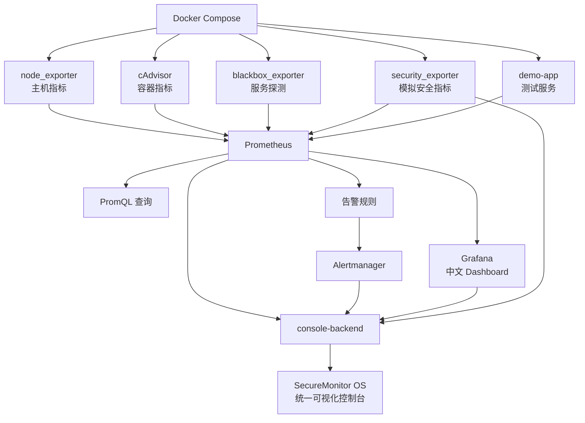

# SecureMonitor OS

基于 Docker / Kubernetes 的 Prometheus + Grafana 安全监控可视化操作台。

本项目对应《网络安全编程技术与实例开发》课程设计第 4 题：基于 Docker 构建 Prometheus + Grafana 监控集群模型及技术实现。

## 项目定位

SecureMonitor OS 不是一个真正的操作系统内核，而是一个“类操作系统风格”的安全监控 Web 控制台。它把 Prometheus、Grafana、Alertmanager、node_exporter、cAdvisor、blackbox_exporter、自定义 security_exporter、demo-app 和 Kubernetes 研究内容整合到同一个课程设计项目中。

本项目采用以下实现策略：

- Docker Compose 版作为主实现，用于本地运行、演示、截图和答辩。
- Kubernetes 版作为扩展研究，用文档和 YAML 示例说明实现思路。
- SecureMonitor OS 控制台作为统一展示入口，适合课程答辩演示。
- Grafana 作为第三方开源可视化工具，用于展示 Prometheus 指标 Dashboard。

## 技术栈

| 类型 | 技术 |
| --- | --- |
| 容器编排 | Docker Compose |
| 指标采集与存储 | Prometheus |
| 可视化 | Grafana |
| 告警管理 | Alertmanager |
| 主机指标 | node_exporter |
| 容器指标 | cAdvisor |
| 服务探测 | blackbox_exporter |
| 自定义安全指标 | security_exporter |
| 测试服务 | demo-app |
| 后端控制台 | FastAPI |
| 前端控制台 | React + Vite + TypeScript |
| Kubernetes 扩展 | kind / minikube / kube-prometheus-stack 研究 |

## 服务组成

| 服务 | 地址 | 作用 |
| --- | --- | --- |
| SecureMonitor OS Console | http://127.0.0.1:7001 | 统一可视化控制台 |
| console-backend | http://127.0.0.1:7000/api/health | 封装 Prometheus、Alertmanager、Grafana、Exporter API |
| Prometheus | http://127.0.0.1:9090 | 指标采集、PromQL 查询、告警规则 |
| Grafana | http://127.0.0.1:3000 | Dashboard 可视化，默认账号 `admin/admin` |
| Alertmanager | http://127.0.0.1:9093 | 告警分组、去重、路由和展示 |
| cAdvisor | http://127.0.0.1:8080 | Docker 容器指标 |
| blackbox_exporter | http://127.0.0.1:9115 | HTTP/TCP 服务可用性探测 |
| security_exporter | http://127.0.0.1:8000/metrics | 自定义模拟安全指标 |
| demo-app | http://127.0.0.1:5000 | 被监控测试服务 |

如果 `localhost` 访问异常，优先使用 `127.0.0.1`。

## 总体流程

1. Docker Compose 一键启动 Prometheus、Grafana、Alertmanager、node_exporter、cAdvisor、blackbox_exporter、security_exporter、demo-app、console-backend 和 console-frontend。
2. node_exporter 采集本机 CPU、内存、磁盘、网络等物理节点指标。
3. cAdvisor 采集 Docker 容器 CPU、内存、网络、磁盘 IO 和运行状态指标。
4. blackbox_exporter 对 demo-app 的 `/health` 接口进行 HTTP 可用性探测。
5. security_exporter 暴露失败登录次数、可疑请求次数、开放端口数量、容器重启次数、高 CPU 进程数量、安全风险分数等模拟安全指标。
6. demo-app 提供 `/health`、`/metrics`、`/api/hello`、`/api/error`、`/api/slow` 等测试接口。
7. Prometheus 根据 `prometheus.yml` 中的 `static_configs` 和 `file_sd_configs` 发现目标并抓取指标。
8. Prometheus 根据 `prometheus/rules/*.yml` 判断告警条件，并把告警发送给 Alertmanager。
9. Alertmanager 对告警进行分组、去重、路由和展示。
10. Grafana 通过 provisioning 自动加载 Prometheus 数据源和四类中文 Dashboard。
11. SecureMonitor OS 前端通过 console-backend 读取 Prometheus、Alertmanager、Grafana 和 security_exporter 数据，形成统一中文可视化界面。

## 架构流程图



## 运行方式

进入项目目录：

```powershell
cd C:\Users\52697\secure-monitor
```

启动全部服务：

```powershell
docker compose up -d
```

查看容器状态：

```powershell
docker compose ps
```

停止全部服务：

```powershell
docker compose down
```

停止并删除持久化数据卷：

```powershell
docker compose down -v
```

注意：`docker compose down -v` 会删除 Prometheus、Grafana、Alertmanager 的本地数据卷，只有需要重新初始化时才使用。

## 演示顺序

推荐答辩演示顺序如下：

1. 打开 SecureMonitor OS： http://127.0.0.1:7001
2. 展示顶部状态栏：Prometheus、Grafana、Alertmanager、Targets、CPU、内存、磁盘。
3. 展示总览页：系统状态、资源摘要、安全摘要、服务拓扑、最近告警。
4. 打开 Targets 页面：说明 Prometheus 静态服务发现和文件型动态服务发现。
5. 打开安全中心：展示 security_exporter 模拟安全指标。
6. 打开异常模拟：触发失败登录或安全风险分数。
7. 打开告警中心：展示 Prometheus + Alertmanager 告警整理结果。
8. 打开 Grafana 页面：跳转 Grafana 中文 Dashboard。
9. 打开 Kubernetes 研究页：说明 Prometheus Operator、kube-prometheus-stack、ServiceMonitor、PodMonitor。

## Grafana 说明

Grafana 是第三方开源可视化工具。本项目通过 Docker 容器运行 Grafana，并通过目录挂载实现自动配置：

```yaml
volumes:
  - ./grafana/provisioning:/etc/grafana/provisioning:ro
  - ./grafana/dashboards:/var/lib/grafana/dashboards:ro
```

Grafana 启动后会自动读取：

- `grafana/provisioning/datasources/prometheus.yml`：添加 Prometheus 数据源。
- `grafana/provisioning/dashboards/dashboards.yml`：加载 Dashboard JSON。
- `grafana/dashboards/*.json`：主机、容器、服务、安全四类中文 Dashboard。

这属于使用第三方开源软件协助开发，符合课程题目对 Prometheus + Grafana 的研究和实现要求。

## 安全边界

- security_exporter 只暴露课程设计模拟指标，不读取真实敏感数据。
- 异常模拟脚本和接口只用于演示，不删除容器、镜像、文件或用户数据。
- 服务宕机和恢复演示以建议命令为主，不在 Web 页面中直接执行危险 Docker 操作。
- 生产环境应额外配置 HTTPS、身份认证、权限控制、审计日志和真实通知渠道。

## 文档索引

| 文档 | 作用 |
| --- | --- |
| `docs/00_course_mapping.md` | 课程要求与项目实现映射 |
| `docs/01_requirements.md` | 需求分析 |
| `docs/02_architecture.md` | 系统架构设计 |
| `docs/03_prometheus_design.md` | Prometheus 采集与服务发现设计 |
| `docs/04_grafana_design.md` | Grafana 可视化设计 |
| `docs/05_alertmanager_design.md` | 告警规则与 Alertmanager 设计 |
| `docs/06_security_monitoring.md` | 自定义安全监控设计 |
| `docs/07_kubernetes_research.md` | Kubernetes 监控研究 |
| `docs/08_test_plan.md` | 测试计划 |
| `docs/09_test_report.md` | 测试报告模板 |
| `docs/10_defense_script.md` | 答辩稿与可能提问 |
| `docs/11_final_acceptance.md` | 最终验收说明 |
| `docs/12_project_file_guide.md` | 项目文件功能说明 |

## 测试结果说明

本项目文档中不编造测试结果。未实际截图或未现场验证的内容统一写为“待本地运行后填写”。

如需完成最终验收，请本地运行：

```powershell
docker compose up -d
docker compose ps
```

然后按 `docs/08_test_plan.md` 和 `docs/09_test_report.md` 补充截图与实际结果。
